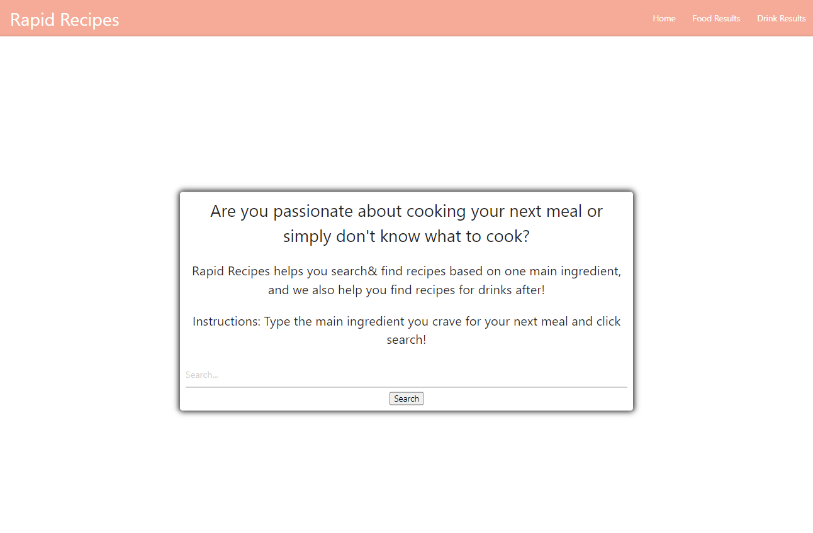
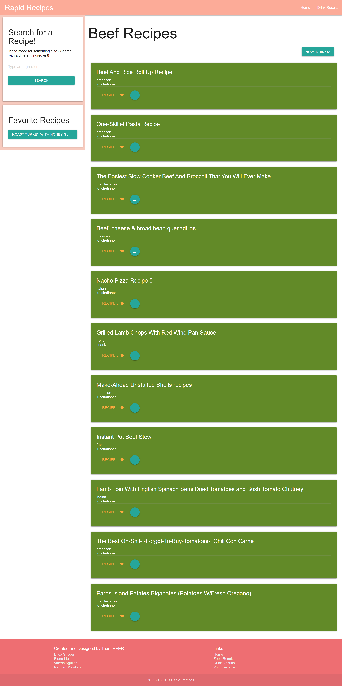
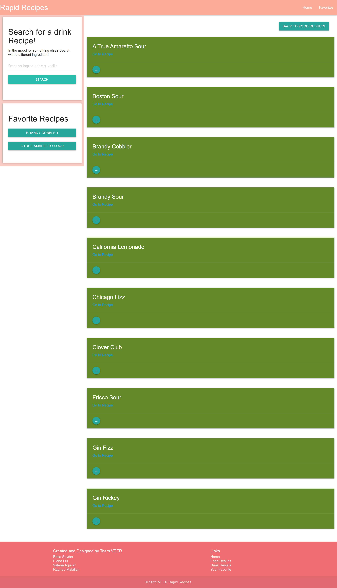
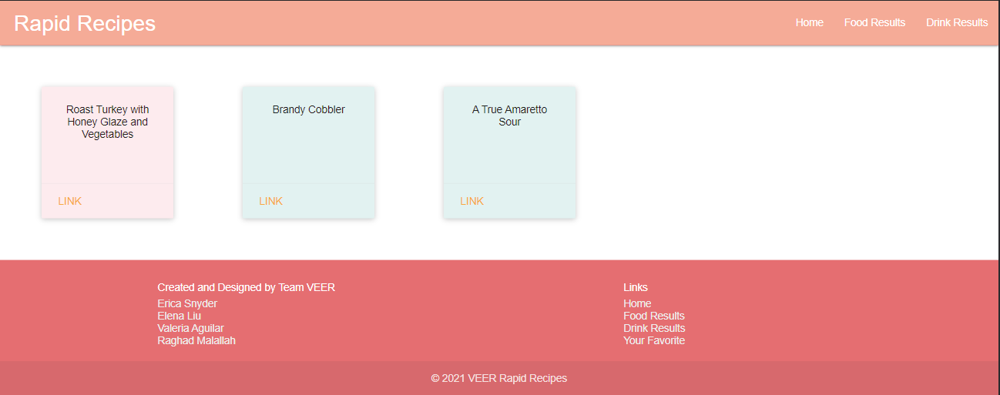
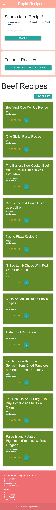
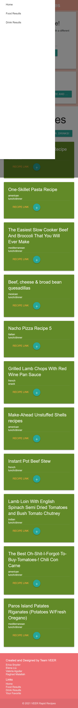

# Rapid Recipes

### Useage
Rapid Recipes can be accessed via this link:
https://ericaleesnyder.github.io/meal-search-engine/

To use this application, the user starts out by entering an ingredient they would like to use in their meals. By clicking "Search" they are able to be seamlessly directed to the food results page. 

On the food results page, the user has the opportunity to navigate to the recipe webpage, see the meal type and cuisine type, add a recipe to their favorites, and also make a new search if they choose to use a different ingredient. 

Similar to the food results page, the drinks page allows the user to search based on an ingredient and add the recipe to the favorites list after viewing the recipe webpage. On both pages, the user can also navigate to the recipe webpage by clicking on the button in the favorites bar. 

Our favorites page allows the user to easily view both their food and drink favorites. Each recipe card brings the user to the recipe page and is conveniently color coded by food or drink recipe. 

To ensure a user friendly experience, we also confirmed our mobile responsive layout. We took into account not only the organization of the screen, but also the menu functionality. 
 

